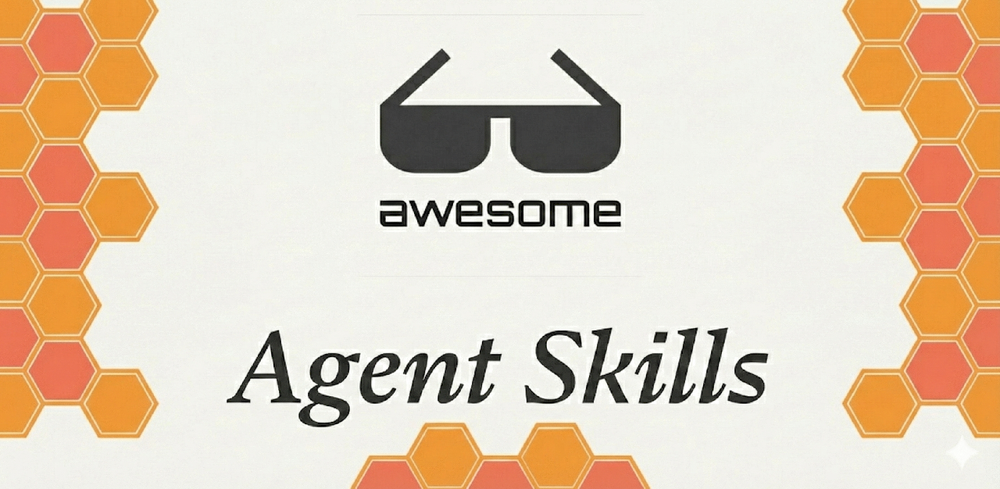
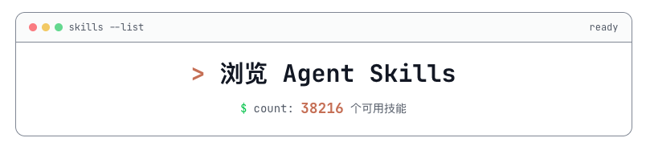

  

  
  
  

本项目致力于收集和分享最优质的 Agent Skills 资源、教程和实践，欢迎通过 Issues 提交参与共建。

> 关注我的 X 账号 [@李不凯正在研究](https://x.com/libukai) ，即时获取有关 Agent Skills 的最新资讯和实用教程！

## 快速入门

Agent Skills 是一个由 Anthropic 维护的 [开放标准](https://agentskills.io/home)，能便捷地将个人经验转化为 AI Skill，快速构建轻量级的 Personal Agent。

-   [Agent Skills 终极指南：入门、精通、预测](https://mp.weixin.qq.com/s/jUylk813LYbKw0sLiIttTQ)
-   [别再当"复读机"了：Claude Code 新王炸功能 Skills 深度研究](https://mp.weixin.qq.com/s/vQkekUtdqF5BJhSVNMU__g)
-   [Cherry Studio + Claude Code：日常工作类 Agent Skills 最佳实践](https://mp.weixin.qq.com/s/nqBMW9QaTcagohzy2gXaZA)
-   [Claude Agent Skills：第一性原理深度解析](https://skills.deeptoai.com/zh/docs/ai-ml/claude-agent-skills-first-principles-deep-dive)

## 产品使用

Agent Skills 开放标准已得到 OpenAI/Github/Cursor 等多家 AI 行业领军公司的支持，迅速被各个主流 AI 产品采用。

-   [Anthropic/Claude Code](https://claude.com/skills)： 在 Claude Code 中使用 Skills 的说明文档
-   [OpenAI/Codex](https://developers.openai.com/codex/skills/)： 在 Codex 中使用 Skills 的说明文档
-   [Github/VS Code](https://code.visualstudio.com/docs/copilot/customization/agent-skills)：在 VS Code 中使用 Agent Skills 的说明文档
-   [Cursor](https://cursor.com/cn/docs/context/skills)：在 Cursor 中使用 Agent Skills 的说明文档

> [!WARNING]
> 阿里旗下的 Qwen Code 从 0.6.0 版本开始实验性支持技能，但采用的是专有标准，与 Agent Skills 开放标准存在差异，详情参见 [官方文档](https://qwenlm.github.io/qwen-code-docs/zh/users/features/skills/)

## 技能商店

-   

仅推荐 [skillsmp](https://skillsmp.com/zh) 这一个 Agent Skills 在线商店。该商店中自动抓取了 Github 上的所有的 Skills 项目，并按照分类、更新时间、Star 数量等标签进行整理，用户可以方便地浏览、搜索和下载所需的 Skills。

## 精选技能

-   [anthropics/skill-creator](https://github.com/anthropics/skills/tree/main/skills/skill-creator): Anthropic 官方出品用于创建 skill 的元 skill，可快速创建个人专属的 Agent Skills
-   [anthropics/skills](https://github.com/anthropics/skills)：Anthropic 官方出品的 Skills 集合，可处理 Office 全系文档格式
-   [obra/superpowers](https://github.com/obra/superpowers/tree/main/skills): 涵盖完整编程项目工作流程的 Skills 集合
-   [ComposioHQ/awesome-claude-skills](https://github.com/ComposioHQ/awesome-claude-skills)：涵盖多个编程类任务的优质 Skills 集合
-   [nextlevelbuilder/ui-ux-pro-max-skill](https://github.com/nextlevelbuilder/ui-ux-pro-max-skill)：面向 UI/UX 设计的 Skills 集合
-   [K-Dense-AI/claude-scientific-skills](https://github.com/K-Dense-AI/claude-scientific-skills)： 面向科研工作者的 Skills 集合

## 配套工具

-   [Skill_Seekers](https://github.com/yusufkaraaslan/Skill_Seekers): 自动化抓取文档网站、GitHub 仓库和 PDF 文件转换为 Agent Skills

## 官方教程

Anthropic 在官方博客中提供了丰富的 Agent Skills 相关教程，推荐阅读以下文章以深入了解 Agent Skills 的概念、创建方法和应用场景：

-   [Introducing Agent Skills: Improve how it performs specific tasks](https://claude.com/blog/skills)
-   [Skills explained: How Skills compares to prompts, Projects, MCP, and subagents](https://claude.com/blog/skills-explained)
-   [Extending Claude’s capabilities with skills and MCP servers](https://claude.com/blog/extending-claude-capabilities-with-skills-mcp-servers)
-   [Equipping agents for the real world with Agent Skills](https://www.anthropic.com/engineering/equipping-agents-for-the-real-world-with-agent-skills)
-   [How to create Skills: Key steps, limitations, and examples](https://claude.com/blog/how-to-create-skills-key-steps-limitations-and-examples)
-   [Building Skills for Claude Code: Automating your procedural knowledge](https://claude.com/blog/building-skills-for-claude-code)
-   [https://www.anthropic.com/engineering/code-execution-with-mcp](https://www.anthropic.com/engineering/code-execution-with-mcp)
-   [Improving frontend design through Skills](https://claude.com/blog/improving-frontend-design-through-skills#real-world-skills-examples)

## 参考资料

-   [Don't Build Agents, Build Skills Instead](https://x.com/iamzhihui/status/2005883147305500681/photo/1)
