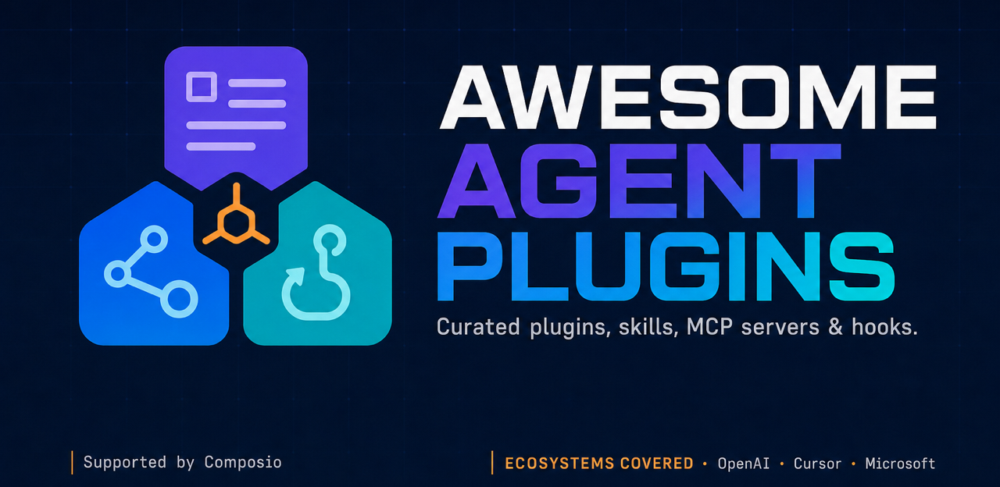

<div>
  <p align="center">
    <a href="https://platform.composio.dev/?utm_source=Github&utm_medium=Youtube&utm_campaign=2025-11&utm_content=AwesomeSkills">
    
    </a>
  </p>
</div>

<div>
  <p align="center">
    <a href="https://awesome.re">
      
    </a>
    <a href="https://makeapullrequest.com">
      
    </a>
    <a href="https://www.apache.org/licenses/LICENSE-2.0">
      
    </a>
  </p>
</div>

<div align="center">

简体中文 | [English](docs/README_EN.md) | [日本語](docs/README_JA.md) 

</div>

# Awesome Agent Plugins

> **Formerly Awesome Agent Skills.** 项目现已转向更完整的 Agent Plugin 生态，旧名称仅作为社区与项目历史的延续。

本项目遵循少而精的原则，收集可发现、可安装、可维护的 Agent Plugins，以及构成它们的优质 Skills、MCP Servers、Apps、Agents、Commands 和 Hooks，帮助开发者理解不同宿主的扩展体系，并找到真正适合任务的能力包。

> 如果觉得这个项目对你有所帮助，还请帮忙点个 🌟 让更多人知晓。同时，也欢迎关注我的 𝕏 账号 [@李不凯正在研究](https://x.com/libukai)，获取 Agent Plugin 生态的最新资源与实战教程！

## 什么是 Agent Plugin

Plugin 是面向最终用户的安装与分发单元，可以把任务说明、工具连接、专用 Agent、自动化 Hook 和交互界面组合成一个完整能力包。

不同生态对 Plugin 的定义仍有差异：[Agent Plugins Specification 1.0](https://agent-plugins.org/specification) 当前只标准化 Skills 与 MCP Servers；Codex、Claude Code、Cursor、GitHub Copilot 和 VS Code 等宿主还支持 Apps、Agents、Commands、Hooks、LSP 或其他扩展。因此，本项目会明确标注格式和宿主，不把“某个宿主能安装”写成“所有 Agent 都兼容”。

| 概念 | 在本项目中的含义 | 是否属于 Plugin 主目录 |
| --- | --- | --- |
| **Plugin** | 有明确包边界、安装方式和版本来源的能力包 | 是 |
| **Component** | Skill、MCP Server、App、Agent、Command、Hook 等单项能力 | 仅在已被打包时；否则进入组件目录 |
| **Marketplace** | 发布、发现、安装和更新 Plugins 的索引 | 进入 Marketplace 目录，不作为单个 Plugin |
| **Collection** | Awesome List、官方合集或专题目录 | 进入生态资源目录，不作为单个 Plugin |

```text
Agent Plugin
├── Instructions & knowledge: Skills
├── Tools & data: MCP Servers, Apps & Connectors
├── Delegation: Agents
├── User entry points: Commands
├── Automation & guardrails: Hooks
├── Code intelligence: LSP Servers
└── UI, assets, templates and other host extensions
```

## Agent Plugin 生态

### 官方 Plugin 集合与市场

- [openai/plugins](https://github.com/openai/plugins)：Codex Plugin 示例与官方目录，包含 Skills、Apps、MCP Servers、Agents、Commands 和 Hooks 等能力面。
- [anthropics/claude-plugins-official](https://github.com/anthropics/claude-plugins-official)：Anthropic 维护的 Claude Code 官方 Plugin 目录。
- [cursor/plugins](https://github.com/cursor/plugins) 与 [cursor/community-plugins](https://github.com/cursor/community-plugins)：Cursor 官方规范、官方 Plugins 与社区目录。
- [github/copilot-plugins](https://github.com/github/copilot-plugins)：GitHub Copilot 官方 Plugin 集合，覆盖 Skills、MCP Servers、Hooks 等扩展。
- [flutter/agent-plugins](https://github.com/flutter/agent-plugins)：Flutter 团队维护的跨 Claude Code、Codex 与 Cursor 的开发能力包。
- [awslabs/agent-plugins](https://github.com/awslabs/agent-plugins)：面向 AWS 架构、部署和运维任务的 Agent Plugins。

### 开放规范与兼容性

- [Agent Plugins](https://agent-plugins.org/)：面向 Skills 与 MCP Servers 的开放、厂商中立的可移植 Plugin 规范。
- [Claude Code Plugins](https://code.claude.com/docs/en/plugins)：Claude Code 的 Plugin 创建、安装与 Marketplace 文档。
- [Cursor Plugins](https://cursor.com/docs/plugins)：Cursor 的 Plugin 格式、Marketplace 和发布文档。
- [GitHub Copilot Plugins](https://docs.github.com/en/copilot/concepts/agents/about-plugins)：Copilot CLI 与 Cloud Agent 的 Plugin 概览。
- [VS Code Agent Plugins](https://code.visualstudio.com/docs/agent-customization/agent-plugins)：VS Code 的 Agent Plugin 支持与跨工具兼容说明。

## 组件生态

组件可以单独使用，也可以进一步组合成 Plugin。下面收录的是高质量发现入口和代表性项目；收录、Star 数和格式校验都不代表安全审计或跨宿主兼容认证。

### Awesome Agent Skills

- [sickn33/agentic-awesome-skills](https://github.com/sickn33/agentic-awesome-skills)：覆盖大规模 Skill 发现、选择、校验与规划的目录和本地工具链。
- [VoltAgent/awesome-agent-skills](https://github.com/VoltAgent/awesome-agent-skills)：面向多种 Agent 宿主的社区 Skill 汇总目录。
- [heilcheng/awesome-agent-skills](https://github.com/heilcheng/awesome-agent-skills)：Agent Skills 教程、指南与目录索引。

### Awesome MCP

- [punkpeye/awesome-mcp-servers](https://github.com/punkpeye/awesome-mcp-servers)：覆盖广泛的 MCP Server 社区目录。
- [yzfly/Awesome-MCP-ZH](https://github.com/yzfly/Awesome-MCP-ZH)：中文 MCP 资源、服务端与客户端指南。
- [wong2/awesome-mcp-servers](https://github.com/wong2/awesome-mcp-servers)：较早建立并持续维护的 MCP Server 目录。
- [jaw9c/awesome-remote-mcp-servers](https://github.com/jaw9c/awesome-remote-mcp-servers)：专注可通过网络连接的 Remote MCP Servers。
- [punkpeye/awesome-mcp-devtools](https://github.com/punkpeye/awesome-mcp-devtools)：MCP 开发、测试、调试和验证工具目录。

### Agent Hooks

- [disler/claude-code-hooks-mastery](https://github.com/disler/claude-code-hooks-mastery)：系统学习 Claude Code Hooks 的示例与教程。
- [karanb192/claude-code-hooks](https://github.com/karanb192/claude-code-hooks)：覆盖安全、成本、可观测性与生产力的 Hook 集合和可安装 Plugin Marketplace。
- [sondera-ai/sondera-coding-agent-hooks](https://github.com/sondera-ai/sondera-coding-agent-hooks)：面向 Claude、Cursor、Gemini 等编码 Agent 的跨宿主 Hook 实现。
- [1Password/agent-hooks](https://github.com/1Password/agent-hooks)：1Password 团队维护的 Agent Hook 实现集合。
- [ithiria894/awesome-claude-code-hooks](https://github.com/ithiria894/awesome-claude-code-hooks)：面向事件驱动自动化的 Claude Code Hook 目录。

## 收录原则

Plugin 主目录只收录具有清晰安装边界和来源的能力包；单独的 Skill、MCP Server、Hook 或其他组件仍然欢迎提交，但会进入相应组件目录。每个提交都应提供支持宿主、包含组件、安装方式、许可证、维护状态、最近核验日期和主要风险面。完整要求见 [CONTRIBUTING.md](CONTRIBUTING.md)。

当前先保持 README-first，不建设新的包管理器或托管市场；当条目规模和维护需求证明有必要时，再引入机器可读目录和自动生成流程。

## 特别致谢


## 项目历史

- 2026-08：项目开始由 Awesome Agent Skills 转型为 Awesome Agent Plugins，原有 Skills 内容收敛为组件生态入口。

[](https://www.star-history.com/?repos=libukai%2Fawesome-agent-skills&type=date&legend=top-left)
