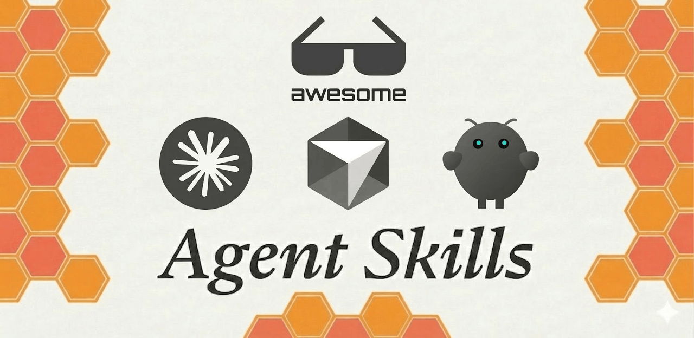
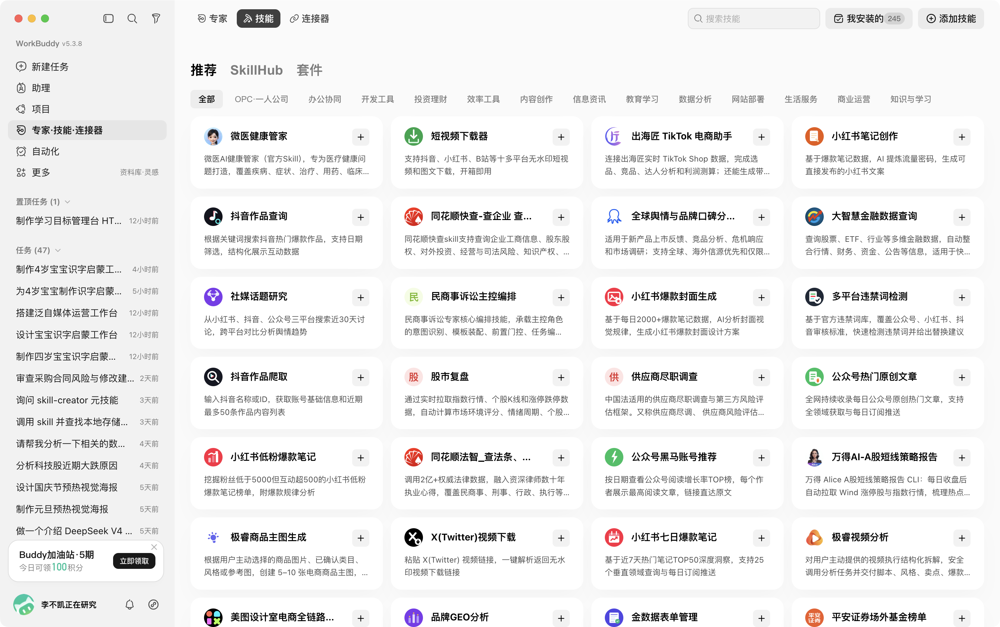
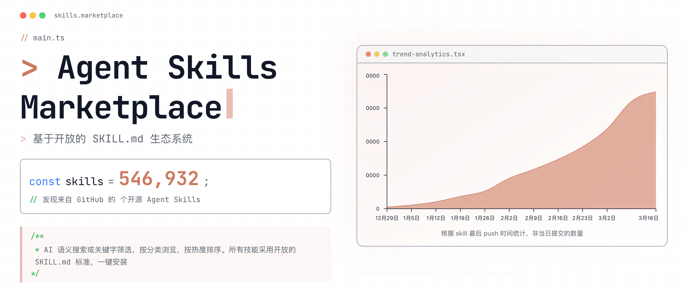
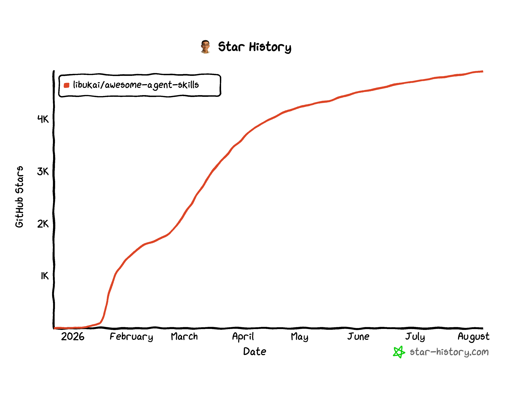

<div>
  <p align="center">
    <a href="https://platform.composio.dev/?utm_source=Github&utm_medium=Youtube&utm_campaign=2025-11&utm_content=AwesomeSkills">
    
    </a>
  </p>
</div>

<div>
  <p align="center">
    <a href="https://awesome.re">
      
    </a>
    <a href="https://makeapullrequest.com">
      
    </a>
    <a href="https://www.apache.org/licenses/LICENSE-2.0">
      
    </a>
  </p>
</div>

<div align="center">

[English](README_EN.md) | 日本語 | [简体中文](../README.md)

</div>

このプロジェクトは少数精鋭の原則に従い、優れた Skill リソース、チュートリアル、実践例を収集・共有することで、より多くの人がパーソナライズされた Agent 構築の第一歩を踏み出せるよう支援します。

> 𝕏 アカウント [@libukai](https://x.com/libukai) および 💬 WeChat 公式アカウント [@李不凯正在研究](https://mp.weixin.qq.com/s/uer7HvD2Z9ZbJSPEZWHKRA?scene=0&subscene=90) をフォローして、Skills の最新リソースと実用的なチュートリアルをいち早く入手してください!

## クイックスタート

Skill は軽量な汎用標準で、ワークフローと専門知識をパッケージ化することで、AI が特定のタスクを実行する能力を強化します。

繰り返し発生するタスクでは、会話のたびに同じ背景情報を入力する必要はありません。対応する Skill をインストールすれば、Agent はその領域に必要な能力を利用できます。

約1年にわたる進化を経て、Skill は AI に領域固有の能力を追加する標準的な手段となり、主要な Agent Harness フレームワークや AI 製品で広くサポートされています。

## サポート状況

Skill のオープン仕様は、Claude Code、ChatGPT と Codex、GitHub Copilot、Cursor、Gemini CLI、VS Code、OpenCode、Kiro、JetBrains Junie など、多数のホストに採用されています。検索パスや実験的フィールドの対応状況はホストごとに異なるため、最新情報は [Agent Skills Client Showcase](https://agentskills.io/clients) と各製品のドキュメントを確認してください。

## 標準構造

Agent Skills は Anthropic が開始し、コミュニティと共同で管理する[オープン仕様](https://agentskills.io/specification)です。各 Skill はワークフロー、資料、スクリプトなどを含む標準化フォルダで、Agent が段階的にロードします。

```markdown
my-skill/
├── SKILL.md          # 必須：メタデータ + 使用手順
├── scripts/          # オプション：実行可能コード
├── references/       # オプション：参考資料とドキュメント
├── assets/           # オプション：テンプレート、リソース
└── ...               # その他のファイルやディレクトリ
```

最小構成の Skill に必要なファイルは `SKILL.md` だけです。

`SKILL.md` の YAML frontmatter には `name` と `description` が必須です。`license`、`compatibility`、`metadata`、実験的な `allowed-tools` も宣言できます。

`name` は64文字以内の小文字、数字、ハイフンで構成し、親ディレクトリ名と一致させます。`description` は1024文字以内で、Skill が「何をするか」と「いつ使うか」の両方を記述します。本文は500行、5000 tokens 未満を目安とし、詳細は用途ごとに分けたリソースファイルへ移します。

`SKILL.md` に加えて、必要に応じて次のファイルやディレクトリを含められます：

- `scripts/`：データ処理、形式変換、結果検証など、反復的、複雑、または決定的な結果を必要とする処理を実行可能コードとして保存します。
- `references/`：領域知識、技術文書、例、データ形式の説明など、特定のタスクでのみ Agent が読む補足資料を保存します。
- `assets/`：文書テンプレート、設定テンプレート、画像、参照表、Schema など、実行時または成果物で使用する静的リソースを保存します。
- その他のファイル：ライセンス、利用者向けドキュメント、タスクの完了に必要なその他のファイルやディレクトリも追加できます。

これらはすべてオプションです。`SKILL.md` から Skill ルートへの相対パスで参照し、Agent がいつ読み取り、または実行するかを明記します。

Agent は通常、3段階で Skill をロードします。起動時には発見のために各 Skill の `name` と `description` だけを読み、タスクが一致すると完全な `SKILL.md` を有効化してロードし、実行中は必要な `scripts/`、`references/`、`assets/` だけを読み込みます。この段階的開示により、コンテキストを過度に消費せず、多数の Skill を利用できます。

## スキルのインストール

Skill は Claude や ChatGPT などの GUI App のほか、Cursor などの IDE や Claude Code などの TUI CLI でも使用できます。

Skill のインストールとは、Agent が必要に応じてロードして使用できるよう、対応するフォルダを所定のディレクトリに配置することです。

### 共通ディレクトリ規約

多くの互換クライアントは、プロジェクトとユーザーの両スコープで `.agents/skills/` を検索します：

```text
<project>/.agents/skills/<skill-name>/
~/.agents/skills/<skill-name>/
```

同名の Skill は通常、プロジェクトレベルがユーザーレベルより優先されます。クライアント固有のディレクトリも検索される場合があるため、正確なパスは各製品のドキュメントを確認してください。プロジェクト Skill はリポジトリと一緒に取得されるため、未知のリポジトリから Skill をロードする前に出所と内容を確認します。

### App でインストール



現在、App で Skill を使用する主な方法は2つあります：App 内蔵の Skill ストアからインストールするか、zip ファイルをアップロードしてインストールする方法です。

一部の App には Skill ストアや管理画面が組み込まれており、インストールと管理を手軽に行えます。

公式ストアにない Skill については、以下で推奨するサードパーティ Skill ストアからダウンロードして手動でインストールできます。

### CLI でインストール



[skillsmp](https://skillsmp.com/zh) マーケットプレイスを使うと、GitHub 上の Skill プロジェクトを発見し、カテゴリ、更新時間、スター数などで絞り込めます。

また、Vercel の [skills.sh](https://skills.sh/) ランキングボードを補助的に使用できます。最も人気のある Skills リポジトリと個別 Skill の使用状況を直感的に確認できます。

特定の Skill については、`npx skills` コマンドラインツールを使用して迅速に発見、追加、管理できます。詳細なパラメータについては [vercel-labs/skills](https://github.com/vercel-labs/skills) を参照してください。

```bash
npx skills find [query]                          # 関連スキルを検索
npx skills add <owner/repo>                      # スキルをインストール（GitHub 省略形、完全 URL、ローカルパス対応）
npx skills add <owner/repo> --list               # リポジトリ内のスキルだけを確認
npx skills use <owner/repo@skill>                # 永続インストールせず一時利用
npx skills list                                  # インストール済みスキルをリスト表示
npx skills update [skill-name]                   # 1つ以上のスキルを更新
npx skills remove [skill-name]                   # スキルをアンインストール
npx skills init [skill-name]                     # スキルテンプレートを作成
```

現在の `skills` CLI は70種類以上の Agent をサポートし、project/global スコープ、対象 Agent、コピーまたはシンボリックリンクによるインストールを指定できます。最新のパラメータは [vercel-labs/skills](https://github.com/vercel-labs/skills) を参照してください。

バージョン固定とサプライチェーンの追跡可能性を重視する場合は、GitHub CLI 2.90.0 以降で提供される public preview の `gh skill` を利用できます：

```bash
gh skill search <query>                          # Skill を検索
gh skill preview <owner/repo> <skill>            # インストール前に内容を確認
gh skill install <owner/repo> <skill>@<tag>      # tag を指定してインストール
gh skill install <owner/repo> <skill> --pin <sha> # commit に固定
gh skill update --all                            # 更新を確認して適用
gh skill publish                                 # Skill を検証して公開
```

`gh skill` はリポジトリ、ref、Git tree SHA を記録し、変更不可の Release、secret scanning、code scanning と組み合わせて利用できます。詳細は [GitHub の発表](https://github.blog/changelog/2026-04-16-manage-agent-skills-with-github-cli/) を参照してください。

## 優質チュートリアル

### 公式ドキュメント

- @Agent Skills：[概要](https://agentskills.io/home)、[仕様](https://agentskills.io/specification)、[クイックスタート](https://agentskills.io/skill-creation/quickstart)
- @Agent Skills：[作成ベストプラクティス](https://agentskills.io/skill-creation/best-practices)、[品質評価](https://agentskills.io/skill-creation/evaluating-skills)、[description 最適化](https://agentskills.io/skill-creation/optimizing-descriptions)、[スクリプト設計](https://agentskills.io/skill-creation/using-scripts)
- @Agent Skills：[Agent に Skills サポートを追加する](https://agentskills.io/client-implementation/adding-skills-support)
- @Anthropic：[Claude Skills 完全構築ガイド](Claude-Skills-完全構建指南.md)
- @Anthropic：[Claude Agent Skills 実践経験](Claude-Code-Skills-実战経験.md)
- @Google：[Agent Skills 5つのデザインパターン](Agent-Skill-五种设计模式.md)

### 図文チュートリアル

- @libukai：[Agent Skills 簡易紹介スライド](../assets/docs/Agent%20Skills%20终极指南.pdf)
- @Eze：[Agent Skills 究極ガイド：入門、習熟、予測](https://mp.weixin.qq.com/s/jUylk813LYbKw0sLiIttTQ)
- @deeptoai：[Claude Agent Skills ファーストプリンシプル深掘り解析](https://skills.deeptoai.com/zh/docs/ai-ml/claude-agent-skills-first-principles-deep-dive)

### 動画チュートリアル

- @Mark's Tech Workshop：[Agent Skill：使い方から原理まで一度に解説](https://www.youtube.com/watch?v=yDc0_8emz7M)
- @白白说大模型：[Agent を作るのはもうやめよう、未来は Skills の時代](https://www.youtube.com/watch?v=xeoWgfkxADI)
- @01Coder：[OpenCode + 智谱GLM + Agent Skills で高品質な開発環境を構築](https://www.youtube.com/watch?v=mGzY2bCoVhU)

## 公式スキル

<table>
<tr><th colspan="5">🤖 AI モデルとプラットフォーム</th></tr>
<tr>
<td><a href="https://github.com/anthropics/skills">anthropics</a></td>
<td><a href="https://github.com/openai/skills">openai</a></td>
<td><a href="https://github.com/google-gemini/gemini-skills">gemini</a></td>
<td><a href="https://github.com/huggingface/skills">huggingface</a></td>
<td><a href="https://github.com/replicate/skills">replicates</a></td>
</tr>
<tr>
<td><a href="https://github.com/elevenlabs/skills">elevenlabs</a></td>
<td><a href="https://github.com/black-forest-labs/skills">black-forest-labs</a></td>
<td><a href="https://github.com/google/skills">google</a></td>
<td><a href="https://github.com/NVIDIA/skills">nvidia</a></td>
<td></td>
</tr>
<tr><th colspan="5">☁️ クラウドサービスとインフラ</th></tr>
<tr>
<td><a href="https://github.com/cloudflare/skills">cloudflare</a></td>
<td><a href="https://github.com/hashicorp/agent-skills">hashicorp</a></td>
<td><a href="https://github.com/databricks/databricks-agent-skills">databricks</a></td>
<td><a href="https://github.com/ClickHouse/agent-skills">clickhouse</a></td>
<td><a href="https://github.com/supabase/agent-skills">supabase</a></td>
</tr>
<tr>
<td><a href="https://github.com/stripe/ai">stripe</a></td>
<td><a href="https://github.com/launchdarkly/agent-skills">launchdarkly</a></td>
<td><a href="https://github.com/getsentry/skills">sentry</a></td>
<td><a href="https://github.com/aws/agent-toolkit-for-aws">aws</a></td>
<td><a href="https://github.com/amd/skills">amd</a></td>
</tr>
<tr>
<td><a href="https://github.com/elastic/agent-skills">elastic</a></td>
<td><a href="https://github.com/mongodb/agent-skills">mongodb</a></td>
<td><a href="https://github.com/redis/agent-skills">redis</a></td>
<td><a href="https://github.com/wandb/skills">wandb</a></td>
<td></td>
</tr>
<tr><th colspan="5">🛠️ 開発フレームワークとツール</th></tr>
<tr>
<td><a href="https://github.com/vercel-labs/agent-skills">vercel</a></td>
<td><a href="https://github.com/microsoft/skills">microsoft</a></td>
<td><a href="https://github.com/expo/skills">expo</a></td>
<td><a href="https://github.com/better-auth/skills">better-auth</a></td>
<td><a href="https://github.com/posit-dev/skills">posit</a></td>
</tr>
<tr>
<td><a href="https://github.com/remotion-dev/skills">remotion</a></td>
<td><a href="https://github.com/slidevjs/slidev/tree/main/skills/slidev">slidev</a></td>
<td><a href="https://github.com/vercel-labs/agent-browser/tree/main/skills">agent-browser</a></td>
<td><a href="https://github.com/browser-use/browser-use/tree/main/skills">browser-use</a></td>
<td><a href="https://github.com/firecrawl/cli">firecrawl</a></td>
</tr>
<tr>
<td><a href="https://github.com/greensock/gsap-skills">gsap</a></td>
<td></td>
<td></td>
<td></td>
<td></td>
</tr>
<tr><th colspan="5">📝 コンテンツとコラボレーション</th></tr>
<tr>
<td><a href="https://github.com/makenotion/skills">notion</a></td>
<td><a href="https://github.com/kepano/obsidian-skills">obsidian</a></td>
<td><a href="https://github.com/WordPress/agent-skills">wordpress</a></td>
<td><a href="https://github.com/langgenius/dify/tree/main/.claude/skills">dify</a></td>
<td><a href="https://github.com/sanity-io/agent-toolkit/tree/main/skills">sanity</a></td>
</tr>
<tr>
<td><a href="https://github.com/hardhackerlabs/podwise-cli">podwise-cli</a></td>
<td><a href="https://github.com/wpsnote/wpsnote-skills">wps</a></td>
<td><a href="https://github.com/marswaveai/skills">listenhub</a></td>
<td><a href="https://github.com/larksuite/cli">lark</a></td>
<td></td>
</tr>
</table>

## 厳選スキル

### プログラミング開発

-   [superpowers](https://github.com/obra/superpowers)：完全なプログラミングプロジェクトワークフローをカバー
-   [frontend-design](https://github.com/anthropics/skills/tree/main/skills/frontend-design)：フロントエンドデザインスキル
-   [ui-ux-pro-max-skill](https://github.com/nextlevelbuilder/ui-ux-pro-max-skill)：より洗練されたパーソナライズされた UI/UX デザイン
-   [archify](https://github.com/tt-a1i/archify)：検証・エクスポート可能なアーキテクチャ図とフロー図
-   [text-to-cad](https://github.com/earthtojake/text-to-cad)：CAD、CAE、CAM 向け Agent Skills
-   [native-feel-skill](https://github.com/yetone/native-feel-skill)：クロスプラットフォーム・デスクトップアプリのネイティブ体験設計

### コンテンツ制作

-   [baoyu-skills](https://github.com/JimLiu/baoyu-skills)：宝玉の個人用 Skills コレクション（WeChat 記事執筆、PPT 作成など）
-   [libukai](https://github.com/libukai/awesome-agent-skills)：Obsidian 関連スキルコレクション、Obsidian の執筆シーンに特化
-   [guizang-ppt-skill](https://github.com/op7418/guizang-ppt-skill)：高品質な HTML スライド生成
-   [cclank](https://github.com/cclank/news-aggregator-skill)：指定分野の最新情報を自動収集・要約
-   [huangserva](https://github.com/huangserva/skill-prompt-generator)：AI 人物画像テキスト生成プロンプトを生成・最適化
-   [dontbesilent](https://github.com/dontbesilent2025/dbskill)：X のインフルエンサーが自身のツイートをもとに制作したコンテンツ制作フレームワーク
-   [seekjourney](https://github.com/geekjourneyx/md2wechat-skill/)：執筆から公開まで AI 支援の WeChat 記事作成
-   [cangjie-skill](https://github.com/kangarooking/cangjie-skill)：書籍、動画、ポッドキャストを実行可能な Agent Skills に蒸留

### 製品活用

-   [wps](https://github.com/wpsnote/wpsnote-skills)：WPS オフィスソフトを操作
-   [notebooklm](https://github.com/teng-lin/notebooklm-py)：NotebookLM を操作
-   [n8n](https://github.com/czlonkowski/n8n-skills)：n8n ワークフローを作成
-   [threejs](https://github.com/cloudai-x/threejs-skills)：Three.js プロジェクト開発を支援
-   [skills-manage](https://github.com/iamzhihuix/skills-manage)：複数の Agent ホスト間でローカル Skills を管理

### その他

-  [pua](https://github.com/tanweai/pua)：PUA スタイルで AI をより一生懸命働かせる
-   [office-hours](https://github.com/garrytan/gstack/tree/main/office-hours)：YC の視点から様々な起業アドバイスを提供
-   [marketingskills](https://github.com/coreyhaines31/marketingskills)：マーケティング能力を強化
-   [scientific-skills](https://github.com/K-Dense-AI/claude-scientific-skills)：研究者のスキルを向上

## セキュリティ監査

Skill は受動的な文書ではありません。description は発見に影響し、本文は Agent の挙動を変え、スクリプトはファイル、ネットワーク、認証情報、外部アカウントへアクセスできます。来歴、内容、依存関係、権限、ランタイム、更新の6層を確認してください。

インストール前に `gh skill preview` または手動で全ファイルを確認し、tag/commit を固定します。実行時は最小権限、サンドボックス、重要操作の人間承認、監査ログを使用してください。ストア掲載、Star 数、仕様準拠だけでは安全性や有効性を証明できません。

初期スキャンには [Cisco AI Defense Skill Scanner](https://github.com/cisco-ai-defense/skill-scanner) または [slowmist-agent-security](https://github.com/slowmist/slowmist-agent-security) を利用できます。[NVIDIA Verified Skills](https://developer.nvidia.com/blog/nvidia-verified-agent-skills-provide-capability-governance-for-ai-agents/) の Skill Card、スキャン、署名、来歴管理も参考になります。スキャナーは人手レビューと隔離実行の代替ではありません。

## スキルの作成

技能ショップから他の人が作成したスキルを直接インストールできますが、適合度とパーソナライズを高めるため、必要に応じて自分でスキルを作成するか、他の人のものをベースに微調整することを強くお勧めします。

### 設計原則

- 実作業から抽出する：モデルの一般知識だけで曖昧な手順を生成せず、成功した手順、人間による修正、プロジェクト資料、障害事例、過去の修正を利用します。
- 一貫した境界を保つ：1つの Skill は、組み合わせ可能で独立して検証できるタスク単位を扱います。狭すぎるとロードと競合のコストが増え、広すぎると正確に起動できません。
- コンテキストを節約する：Agent が知らない、または間違えやすい内容に集中し、詳細は用途別の参照ファイルへ移して読み込む条件を明示します。
- 制御の強さを調整する：壊れやすい、不可逆、順序依存の操作は厳密に指定し、複数の妥当な方法があるタスクでは目的と理由を説明して判断の余地を残します。
- デフォルトを提示する：信頼できる既定手段と必要な回避策を示し、同列の選択肢や1回限りの回答ではなく再利用可能な手順を優先します。
- フィードバックループを組み込む：Gotchas、出力テンプレート、チェックリスト、検証ループ、plan-validate-execute を活用します。

### スクリプトとリソース

既存ツールで安定して処理できる単純な一回限りの操作は、`SKILL.md` からコマンドを直接参照できます。繰り返す処理や複雑なロジックは、テスト済みの `scripts/` に移します。パスは Skill ルートからの相対パスを使い、各ファイルをいつ呼び出すか明記します。

- 依存バージョンを固定し、実行環境やネットワーク要件を `compatibility` または本文に記載します。
- 対話式入力を避け、引数、環境変数、stdin で入力を受け取り、簡潔な `--help` を提供します。
- エラーを次の行動につながる内容にし、構造化データは stdout、診断や進捗は stderr に出力します。
- `references/` 内のファイルは焦点を絞り、深い参照チェーンを避けます。

公式の [Using scripts in skills](https://agentskills.io/skill-creation/using-scripts) ガイドも参照してください。

### テストと評価

Skill の評価は2つの観点に分けられます。**`description` 評価**では、使うべき場面で Agent が正しく Skill を起動し、使うべきでない場面では誤起動を避けられるかを確認します。**Skill 効果評価**では、ロード後にタスクの品質、安定性、効率が実際に向上するかを確認します。前者は「適切な Skill を見つけられるか」、後者は「見つけた Skill が本当に役立つか」を問うものです。明確な成功基準を持つ現実的なタスクで継続的に回帰テストし、Skill を使わない場合や旧バージョンと結果を比較します。

完全な手順は、公式の[品質評価](https://agentskills.io/skill-creation/evaluating-skills)と[description 最適化](https://agentskills.io/skill-creation/optimizing-descriptions)を参照してください。

- [SkillsBench](https://www.skillsbench.ai/)：クロスドメイン評価ベンチマークとランキング
- [microsoft/waza](https://github.com/microsoft/waza)：Skill の作成、テスト、計測、改善
- [microsoft/SkillOpt](https://github.com/microsoft/SkillOpt)：軌跡と検証セットに基づくテキスト最適化
- [alibaba/skill-up](https://github.com/alibaba/skill-up)：評価と進化のツール
- [rpamis/comet](https://github.com/rpamis/comet)：アイデアを評価済み Agent ワークフローへ反復

既存研究が示す共通の結論は、明確な受け入れ基準と継続的な回帰テストを備えた、単一タスクに集中する Skill のほうが、範囲の広すぎる知識パッケージより一般に信頼できるということです。古い、またはタスクに適合しない Skill は、コストを増やし、成功率を下げる可能性があります。

## 特別謝辞


## プロジェクト履歴

[](https://www.star-history.com/?repos=libukai%2Fawesome-agent-skills&type=date&legend=top-left)
